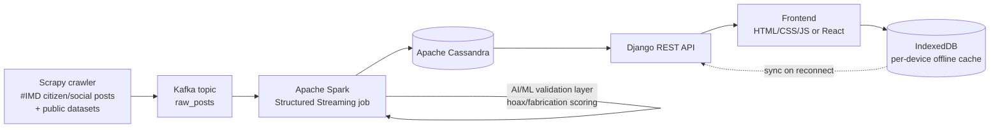
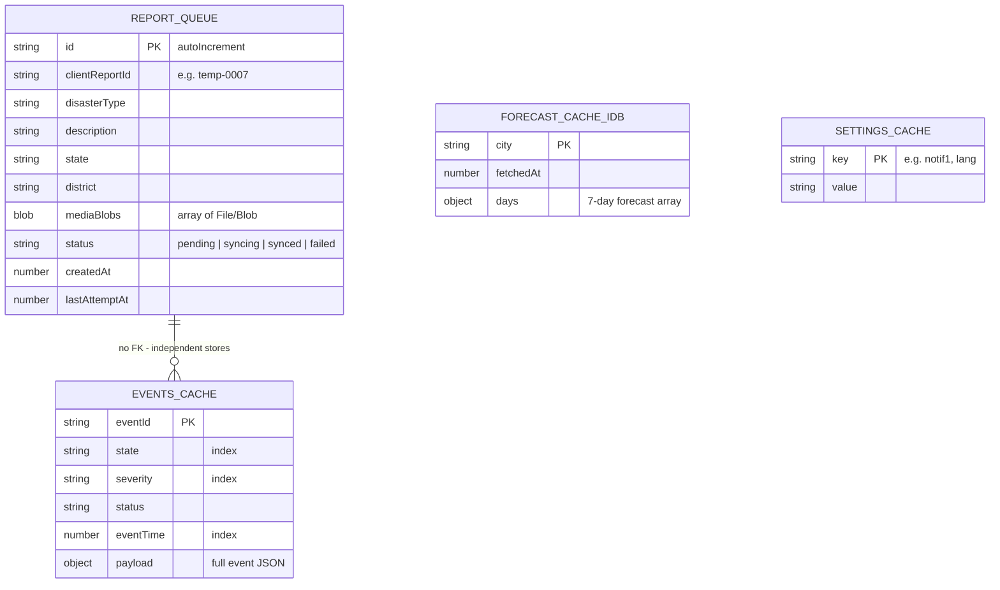

# Weathered — Architecture

## 1. End-to-end pipeline



The frontend (`/frontend-vanilla` or `/frontend-react`) never talks to Cassandra directly — it only calls the Django REST endpoints in `/backend/django`. Offline, it reads/writes its own IndexedDB store and replays queued writes once `navigator.onLine` flips back to `true`.

## 2. Apache Cassandra schema

Keyspace `weathered`, `SimpleStrategy`, RF 3. Full DDL: `/backend/cassandra/schema.cql`.

| Table | Partition key | Clustering key | Purpose |
|---|---|---|---|
| `weather_events` | `state` | `event_time DESC, event_id` | Validated events, read per state (Home/Events pages) |
| `events_by_severity` | `severity` | `event_time DESC, event_id` | Denormalized copy for "all high-severity" queries |
| `disaster_reports` | `state, district` | `created_at DESC, report_id` | Citizen reports, read per District Authority |
| `reports_by_id` | `report_id` | — | Look up a report by its public ID |
| `forecast_cache` | `city` | `forecast_date` | Pre-computed 7-day forecast, refreshed on a schedule |
| `alert_subscriptions` | `device_id` | — | Per-device notification toggles (Settings page) |
| `crawl_audit` | `crawl_date` | `crawled_at DESC, post_id` | Every crawled post, accepted or rejected, for review |

```mermaid
erDiagram
  WEATHER_EVENTS {
    text state PK
    timestamp event_time CK
    uuid event_id CK
    text event_type
    text category
    text city
    text severity
    text status
    text source
    double latitude
    double longitude
    double validation_score
  }
  EVENTS_BY_SEVERITY {
    text severity PK
    timestamp event_time CK
    uuid event_id CK
    text state
    text city
  }
  DISASTER_REPORTS {
    text state PK
    text district PK
    timestamp created_at CK
    text report_id CK
    text disaster_type
    text description
    double gps_lat
    double gps_lon
    list_text media_refs
    text sync_status
  }
  REPORTS_BY_ID {
    text report_id PK
    text state
    text district
  }
  FORECAST_CACHE {
    text city PK
    date forecast_date CK
    int high_c
    int low_c
    text condition
  }
  ALERT_SUBSCRIPTIONS {
    text device_id PK
    boolean severe_weather
    boolean disaster_alerts
  }
  CRAWL_AUDIT {
    date crawl_date PK
    timestamp crawled_at CK
    text post_id CK
    text validation_result
    uuid linked_event_id
  }

  WEATHER_EVENTS ||--o{ EVENTS_BY_SEVERITY : "denormalized copy"
  DISASTER_REPORTS ||--|| REPORTS_BY_ID : "id lookup index"
  CRAWL_AUDIT ||--o{ WEATHER_EVENTS : "linked_event_id (accepted posts)"
```

Cassandra tables are designed around **query patterns, not entities** — that's why `weather_events` and `events_by_severity` hold the same rows twice under different partition keys: Cassandra has no server-side joins, so each distinct "read by X" access pattern gets its own table (write-time denormalization).

## 3. Client-side storage: why IndexedDB (not just `localStorage`)

The current prototype uses `localStorage` for the offline report queue (`wx_queue`) and settings toggles. That's fine for small key/value flags, but it's synchronous, string-only, and capped at ~5MB — not suitable for queuing report attachments (photos/video) while offline. The recommended production schema moves the report queue and any cached lists to **IndexedDB**, keeping `localStorage` only for tiny preferences (theme, language).



Recommended object stores in an IndexedDB database named `weathered_db` (version 1):

| Object store | Key path | Indexes | Notes |
|---|---|---|---|
| `reportQueue` | `id` (autoIncrement) | `status`, `createdAt` | Holds pending reports **including attached media as `Blob`s**; a background sync loop reads `status='pending'` on reconnect and POSTs to `/api/reports/`. |
| `eventsCache` | `eventId` | `state`, `severity`, `eventTime` | Last-fetched page of `weather_events`/`events_by_severity` for offline viewing of Home/Events. |
| `forecastCache` | `city` | — | Last-fetched 7-day forecast per city so Forecast can show *stale-but-labeled* data offline instead of nothing (an improvement on today's "unavailable offline" screen). |
| `settingsCache` | `key` | — | Mirrors the small `localStorage` flags for consistency if the app is later split into a Service Worker context, where `localStorage` isn't available. |

```js
const req = indexedDB.open('weathered_db', 1);
req.onupgradeneeded = (e) => {
  const db = e.target.result;
  const reportQueue = db.createObjectStore('reportQueue', { keyPath: 'id', autoIncrement: true });
  reportQueue.createIndex('status', 'status');
  reportQueue.createIndex('createdAt', 'createdAt');

  const events = db.createObjectStore('eventsCache', { keyPath: 'eventId' });
  events.createIndex('state', 'state');
  events.createIndex('severity', 'severity');
  events.createIndex('eventTime', 'eventTime');

  db.createObjectStore('forecastCache', { keyPath: 'city' });
  db.createObjectStore('settingsCache', { keyPath: 'key' });
};
```

## 4. Where each file lives

```
weathered/
├── frontend-vanilla/     index.html, styles.css, app.js  (fixed: live greeting/date/location)
├── frontend-react/       Vite + React port, same visual identity, same fixes
├── backend/
│   ├── cassandra/schema.cql
│   ├── spark/ingest_job.py
│   └── django/weathered_api/  models.py, views.py, serializers.py, urls.py
└── docs/ARCHITECTURE.md  (this file)
```
